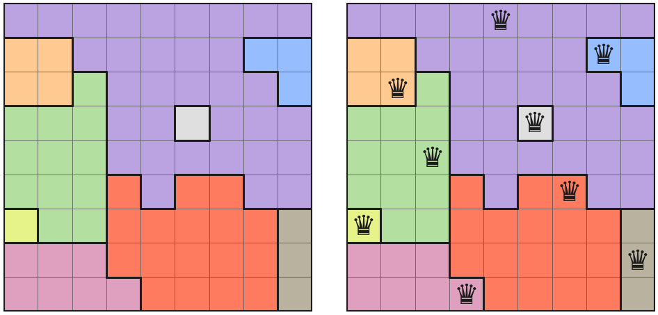

# queens-solver


A solver for LinkedIn's daily **Queens** puzzle, written as a binary integer
linear program in Python with [PuLP](https://coin-or.github.io/pulp/).

The rules of Queens boil down to a handful of 'only one' constraints, which
is exactly the kind of problem integer programming is built for. This project
models the puzzle that way, solves boards in a few milliseconds, checks whether
a puzzle's answer is unique, and generates new puzzles.

I was inspired to do this after learning the assignment problem in Linear Optimization.



## The rules

You get an N×N grid split into N colored regions. Place N queens so that:

1. every **row** has exactly one queen,
2. every **column** has exactly one queen,
3. every **color region** has exactly one queen, and
4. no two queens **touch**, not even diagonally.

Rule 4 is only about neighboring cells. Unlike chess, two queens can share a
long diagonal as long as they aren't next to each other.

## The model

Let $x_{r,c} \in \{0, 1\}$ be 1 when there's a queen in row $r$, column $c$.

$$
\begin{aligned}
\sum_{c} x_{r,c} &= 1 && \forall\, r && \text{(one per row)}\\
\sum_{r} x_{r,c} &= 1 && \forall\, c && \text{(one per column)}\\
\sum_{(r,c) \in R} x_{r,c} &= 1 && \forall\, \text{regions } R && \text{(one per region)}\\
x_{r,c} + x_{r,c+1} + x_{r+1,c} + x_{r+1,c+1} &\le 1 && \forall\, r, c < N-1 && \text{(no touching)}
\end{aligned}
$$

There's no objective since any feasible point is the answer.

The no-touching constraint took the most thought. The obvious way is to write
one inequality for every pair of neighboring cells, but any two touching cells
always sit inside some 2×2 window, so a single "at most one queen per 2×2
window" constraint covers every case. An 8×8 board ends up with 64 binary
variables and 73 constraints.

**Uniqueness check.** After finding a solution $S$, I add the cut
$\sum_{(r,c) \in S} x_{r,c} \le N-1$, which rules out that exact placement,
then solve again. If the model is now infeasible, the puzzle has exactly one
answer.

**Puzzle generator.** It places N legal queens at random, grows a region out
from each one, then keeps asking the solver for a *different* solution. Each
time it finds one, it moves one of that rival solution's queen cells into a
neighboring region, which breaks the rival while keeping the planted solution
valid. Once the solver can't find a rival, the puzzle is unique.

## Setup

Requires Python 3.10+.

```bash
git clone https://github.com/aryanbpatel/queens-solver.git
cd queens-solver
pip install -e .            # installs the `queens` command
pip install -e ".[png]"     # optional: adds matplotlib for image output
```

PuLP 3.x comes with the CBC solver built in, so you don't need to install
anything else. (PuLP 4.0 makes CBC a separate install, so this project sticks
with 3.x for now.)

## Usage

Type the puzzle into a text file with one letter per region:

```text
# puzzles/medium-9x9.txt
AAAAAAAAA
BBAAAAACC
BBDAAAAAC
DDDAAEAAA
DDDAAAAAA
DDDFAFFAA
GDDFFFFFH
IIIFFFFFH
IIIIFFFFH
```

Then:

```bash
queens solve puzzles/medium-9x9.txt              # colored board in the terminal
queens solve puzzles/medium-9x9.txt --unique     # also confirm there's only one answer
queens solve puzzles/medium-9x9.txt --png out.png

queens check puzzles/medium-9x9.txt 1,5 2,8 3,2 4,6 5,3 6,7 7,1 8,9 9,4

queens generate 8 --seed 42 -o puzzles/my-puzzle.txt
```

```text
$ queens solve puzzles/medium-9x9.txt --unique --no-color
 a  a  a  a  Q  a  a  a  a
 b  b  a  a  a  a  a  Q  c
 b  Q  d  a  a  a  a  a  c
 d  d  d  a  a  Q  a  a  a
 d  d  Q  a  a  a  a  a  a
 d  d  d  f  a  f  Q  a  a
 Q  d  d  f  f  f  f  f  h
 i  i  i  f  f  f  f  f  Q
 i  i  i  Q  f  f  f  f  h

Queens (row, col): (1,5)  (2,8)  (3,2)  (4,6)  (5,3)  (6,7)  (7,1)  (8,9)  (9,4)
9x9 board | 81 binary vars, 91 constraints | solved in 7 ms
Solution is unique.
```

You can also use it from Python:

```python
from queens_solver import Puzzle, solve

puzzle = Puzzle.from_file("puzzles/medium-9x9.txt")
print(solve(puzzle).queens)   # [(0, 4), (1, 7), (2, 1), ...]  (0-indexed)
```

## Tests

```bash
python -m unittest discover -s tests -t .
```

On top of the regular unit tests, the suite builds 60 random boards (some
with no solution, some with one, some with several), solves each one by brute
force over every column permutation, and checks that the ILP returns the same
set of solutions. It also checks that every generated puzzle has exactly one
answer and that all its regions are connected.

## Performance

Median solve time on generated puzzles (6 seeds per size, CBC via PuLP):

| Board | Variables | Constraints | Solve time |
|------:|----------:|------------:|-----------:|
|  6×6  |    36     |     43      |   ~4 ms    |
|  8×8  |    64     |     73      |   ~5 ms    |
| 10×10 |   100     |    111      |   ~6 ms    |
| 12×12 |   144     |    157      |   ~7 ms    |

## Project layout

```text
queens_solver/
  board.py      puzzle parsing and a plain-Python rule checker
  solver.py     the PuLP model, solve(), and solution counting
  generator.py  random unique-puzzle generator
  render.py     terminal and PNG output
  cli.py        the `queens` command
puzzles/        example boards (plus one with no solution)
tests/
```

## Ideas for later

- Read a board straight from a screenshot using OpenCV to detect the grid
  and color clusters
- Rate puzzle difficulty by how many logical deductions it takes, not just
  board size
- Compare the ILP with a constraint programming solver like OR-Tools CP-SAT

## License

MIT
